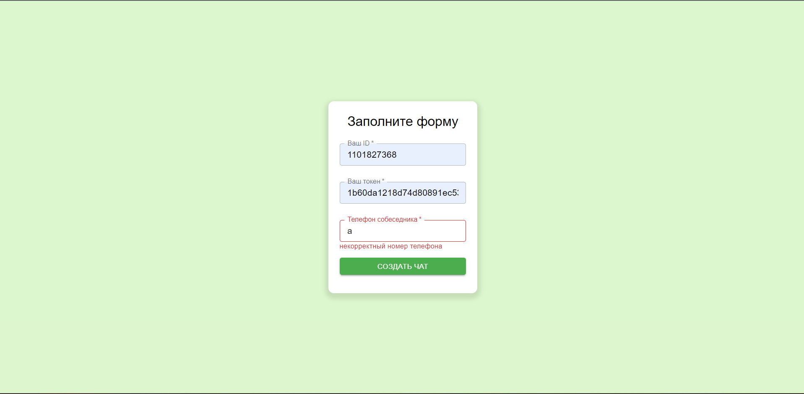
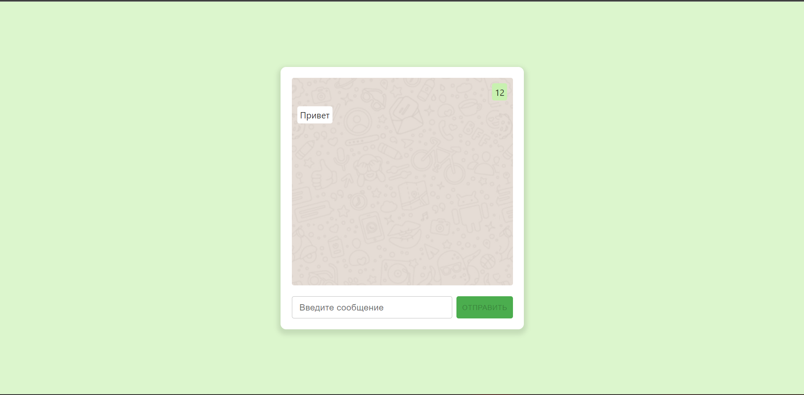

# Тестовое задание.

## Требования:
1. Требуется разработать пользовательский интерфейс для отправки и получений
   сообщений WhatsApp
2. Требуется использовать сервис GREEN-API https://green-api.com/
3. Требуется реализовать отправку и получение только текстовых сообщений
4. Требуется за прототип интерфейса взять внешний вид чата
   https://web.whatsapp.com/
5. Требуется реализовать интерфейс максимально простым с минимальным набором
   функций

6. Требуется отправку сообщений реализовать методом https://green-
   api.com/docs/api/sending/SendMessage/

7. Требуется получение сообщений реализовать методом https://green-
   api.com/docs/api/receiving/technology-http-api/

8. Требуется использовать технологию React

## Инструкцию для локального запуска проекта

1. Зарегистрироваться в https://green-api.com/ 
2. Установить в настройках (Получать уведомления о входящих сообщениях и файлах, Получать уведомления о сообщениях, отправленных с API)
3. yarn install

## Stack:
- React
- Typescript
- MobX
- MUI
- IDE- WebStorm
